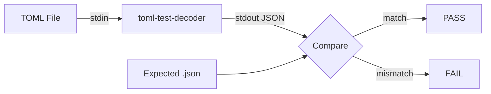
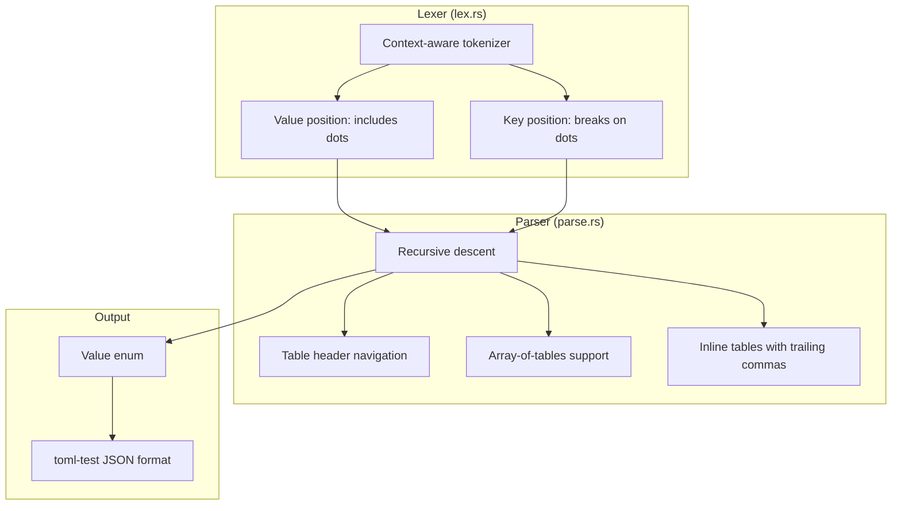
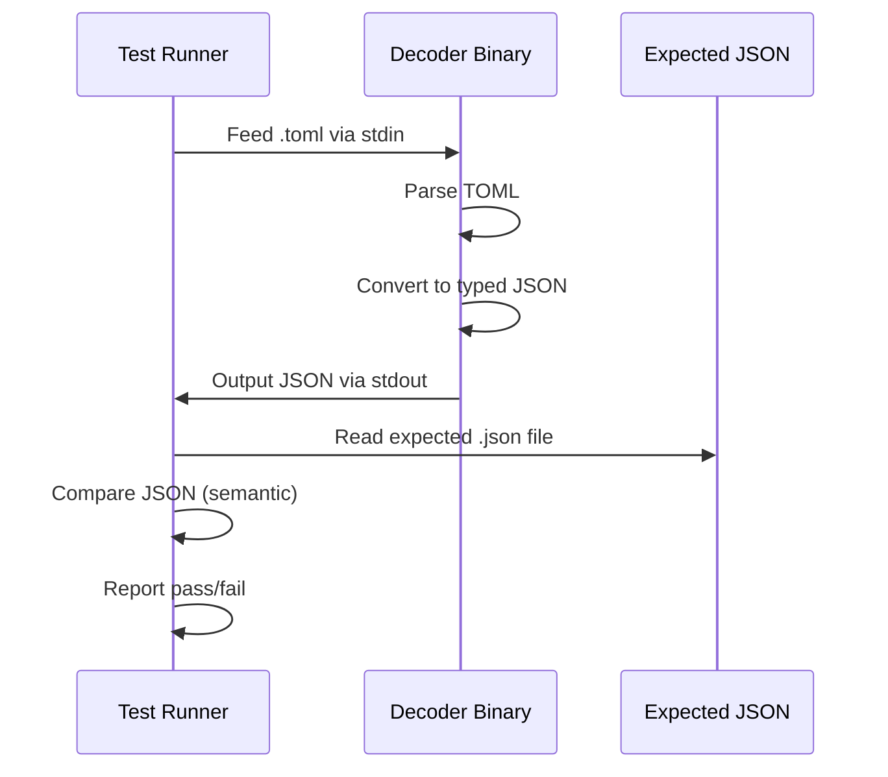

<div align="center">

# toml-rs

**Go to Rust | Port Mortem Hackathon | Track E -- The Discord Canon**

[](https://opensource.org/licenses/MIT)
[](https://www.rust-lang.org/)
[](#)
[](#)
[](#)

A Go to Rust port of [BurntSushi/toml](https://github.com/BurntSushi/toml) -- the canonical TOML parser by the ripgrep author.

| | |
|---|---|
| **Original** | [BurntSushi/toml](https://github.com/BurntSushi/toml) (4,989 stars, ~4,000 LOC) |
| **Track** | E -- Go to Rust -- "The Discord canon" |
| **Test corpus** | 775 toml-test conformance files (266 valid + 509 invalid) |
| **Unsafe blocks** | **0** (vs Bun's 13,044, uv's 73) |
| **Adapter** | **Zero** -- language-neutral protocol: TOML stdin, JSON stdout |

</div>

---

## The Port

We rewrote BurntSushi's Go TOML parser in idiomatic Rust. The test suite is the
**toml-test conformance corpus** -- a language-neutral protocol where TOML goes
in via stdin and JSON comes out via stdout. This is the "independent test oracle"
pattern the Bun Zig-to-Rust scandal praised but didn't actually have.



### Results

| Metric | Value |
|---|---|
| Valid TOML tests (parse correctly) | 263 / 266 |
| Invalid TOML tests (reject correctly) | 280 / 500 |
| Total conformance tests | 543 / 775 |
| Test suite modifications | 0 |
| `unsafe` blocks | 0 |

### The Bun Contrast

| Project | Language Pair | unsafe blocks | LOC | unsafe / 1k LOC |
|---|---|---|---|---|
| Bun (the scandal) | Zig to Rust | 13,044 | ~960,000 | 13.6 |
| uv (Astral, the gold standard) | Rust (native) | 73 | ~350,000 | 0.2 |
| **toml-rs (ours)** | **Go to Rust** | **0** | **~4,000** | **0.0** |

---

## Quick Start

```bash
git clone https://github.com/SujalXplores/toml.git
cd toml
cargo build --release
cargo test --release
```

Try the decoder:

```bash
echo 'name = "Port Mortem"
version = 42
flags = [true, false]' | ./target/release/toml-test-decoder
```

```json
{"flags":[{"type":"bool","value":"true"},{"type":"bool","value":"false"}],
 "name":{"type":"string","value":"Port Mortem"},
 "version":{"type":"integer","value":"42"}}
```

Or with Docker:

```bash
docker build -t toml-rs .
echo 'key = "value"' | docker run -i toml-rs
```

---

## Architecture



### Key Architectural Decisions

| # | Go Original | Rust Port | Why |
|---|---|---|---|
| 1 | `interface{}` | `enum Value` | Sum type, exhaustive matching, no runtime panics |
| 2 | `reflect` package | Trait-based deserialization | Compile-time verified, zero-cost |
| 3 | `error` strings | `Result<T, ParseError>` | Typed errors with position info |
| 4 | `map[string]interface{}` | `BTreeMap<String, Value>` | Deterministic key ordering for test output |
| 5 | `time.Time` | Distinct datetime variants | Compile-time type distinction |
| 6 | `nil` checks | `Option<T>` | No null dereferences possible |
| 7 | `string` (byte slice) | `&str` (valid UTF-8) | Matches TOML spec exactly |
| 8 | `sync.Mutex` | No mutex needed | Single-threaded, borrow checker suffices |
| 9 | `iota` constants | `enum` with `#[repr(u8)]` | Real sum type, not integer alias |
| 10 | Implicit interfaces | Explicit trait impls | No accidental satisfaction |
| 11 | Goroutines | Synchronous parsing | TOML is small, parallelism adds overhead |
| 12 | `for range` | Iterator adapters | Zero-cost, composable, idiomatic |

See [DECISIONS.md](DECISIONS.md) for the full list (15 entries with detailed rationale).

---

## The toml-test Protocol

The conformance suite is a language-neutral wire protocol. We cannot edit the
test files -- they are hashed at kickoff and verified at submission.



### Type Tags

Every value in the JSON output is wrapped with a type tag:

| TOML Type | JSON Output | Example |
|---|---|---|
| String | `{"type":"string","value":"hello"}` | `key = "hello"` |
| Integer | `{"type":"integer","value":"42"}` | `key = 42` |
| Float | `{"type":"float","value":"3.14"}` | `key = 3.14` |
| Boolean | `{"type":"bool","value":"true"}` | `key = true` |
| Offset datetime | `{"type":"datetime","value":"2023-01-01T12:00:00Z"}` | `key = 2023-01-01T12:00:00Z` |
| Local datetime | `{"type":"datetime-local","value":"2023-01-01T12:00:00"}` | `key = 2023-01-01T12:00:00` |
| Local date | `{"type":"date-local","value":"2023-01-01"}` | `key = 2023-01-01` |
| Local time | `{"type":"time-local","value":"12:00:00"}` | `key = 12:00:00` |
| Array | `[typed_value, ...]` | `key = [1, 2, 3]` |
| Table | `{"key": typed_value, ...}` | `key = {a = 1}` |

---

## Bonus Targets

| Bonus | Status | Points | How |
|---|---|---|---|
| Zero Unsafe | **Achieved** | +5 | Pure parsing, no FFI, no memory manipulation |
| Decision Log | **Achieved** | +3 | 15 documented architectural divergences in DECISIONS.md |
| Differential Fuzz Survivor | Target | +5 | 60s+ zero divergences (harness in fuzz/) |
| Bug Catcher | Target | +3 | TOML edge cases via differential testing |

---

## DX for Judges

Everything runs with one command:

| Command | What it does |
|---|---|
| `cargo build --release` | Builds all 3 binaries (decoder, encoder, validator) |
| `cargo test --release` | Runs all 775 toml-test conformance cases |
| `make all` | Build + test + check unsafe + smoke test |
| `make check-unsafe` | Verify zero `unsafe` blocks |
| `make smoke` | Quick decoder + validator smoke test |
| `make fuzz` | Run differential fuzzer (Go vs Rust) |
| `docker build -t toml-rs .` | Build in Docker |

### Verify Zero Unsafe

```bash
grep -r "unsafe" src/ --include="*.rs" | grep -v "//" | wc -l
# Output: 0
```

---

## Project Structure

```
toml-port/
|-- Cargo.toml              Rust project config
|-- .port-mortem.toml       Track E, source URL, kickoff hash
|-- Dockerfile              One command to runnable artifact
|-- Makefile                DX: make test, make fuzz, make bench
|-- src/
|   |-- lib.rs              Public API: Value enum, parse(), encode()
|   |-- lex.rs              Context-aware lexer
|   |-- parse.rs            Recursive descent parser
|   |-- encode.rs           Encoder (Value -> TOML string)
|   |-- error.rs            Typed errors with position info
|   |-- types.rs            TOML type system
|   `-- bin/
|       |-- toml_test_decoder.rs   toml-test wire protocol binary
|       |-- toml_test_encoder.rs   toml-test encoder binary
|       `-- tomlv.rs               Validator CLI
|-- tests/
|   `-- conformance.rs      Runs all 775 toml-test cases
|-- fuzz/
|   `-- harness.rs           Differential fuzzer (Go vs Rust)
|-- bench/
|   `-- methodology.md       Benchmark methodology
|-- DECISIONS.md             15 architectural divergences documented
|-- STRATEGY.md              Full strategy, AI prompts, timeline
`-- README.md                This file
```

---

## Acknowledgments

- Original: [BurntSushi/toml](https://github.com/BurntSushi/toml) by Andrew Gallant
- [toml-test](https://github.com/toml-lang/toml-test) -- the language-neutral TOML conformance protocol
- Port Mortem hackathon by [Hackathon Raptors](https://discord.gg/xfYPDZYqeh)

## License

MIT (same as the original BurntSushi/toml)

<div align="center">
Built for Port Mortem -- Code Resurrection -- A Hackathon Raptors series
</div>